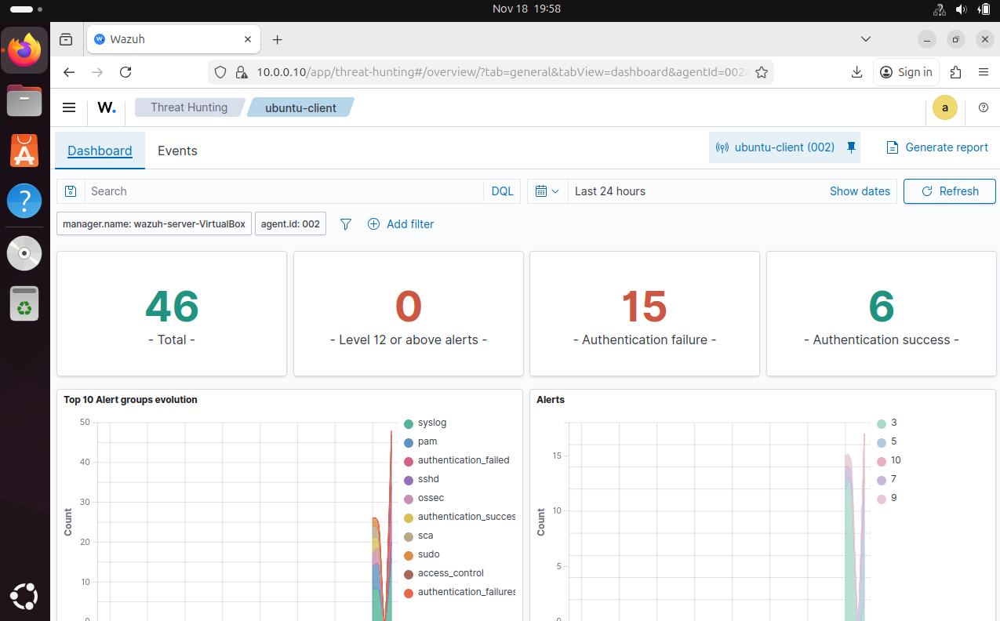
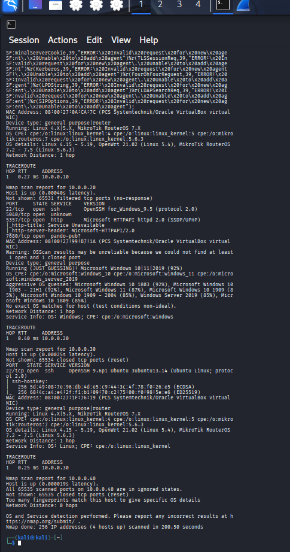
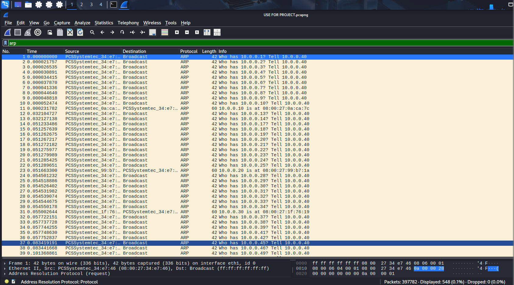

 Strengthening of Organizational Cybersecurity for Hypothetical IT Solutions Through an Incident Response Plan, Wazuh SIEM, and Simulated Cyber Attacks  

Joseph D Susca  

**Summary**  
        This project addressed a critical gap at Hypothetical IT Solutions, a cybersecurity firm responsible for securing the networks and responding to any cybersecurity incidents with which they are contracted. Until now, Hypothetical IT Solutions has not had a formal incident response plan, nor has it used a centralized monitoring tool. This lack of structure led to slower response times and inconsistent incident handling, resulting in overall stakeholder dissatisfaction. To resolve these issues, this project implemented a conceptual Incident Response (IR) plan in accordance with *NIST SP 800-61 Rev. 3*. In conjunction with the incident response plan, a Wazuh Security Information and Event Monitoring (SIEM) tool was deployed to enable real-time network monitoring. During implementation and testing, a tool with the capability to monitor traffic going over the network, named Wireshark, was used as a supplemental tool to validate malicious activity on the network.  
        The project was executed by reviewing the current cybersecurity infrastructure and plans in place with Hypothetical IT Solutions. Following this review, a conceptual incident response plan was implemented, alongside the Wazuh SIEM. With both of these remedies in place, simulated cyber attacks were conducted to test the capabilities of the new cybersecurity infrastructure. First, a reconnaissance tool named “Nmap” was used from a simulated attacker’s computer to scan the other computers on the network for possible vulnerabilities. After finding an open port linked to a remote access tool known as Secure Shell (SSH) being open on other computers, multiple failed SSH connection attempts were made. During testing, Wireshark was able to detect network reconnaissance attempts within seconds, and Wazuh was able to detect failed SSH attempts on both Windows and Ubuntu clients, logging these alerts for further investigation. These results demonstrated that the implemented tools and response plans led to a more structured approach to incident handling, resulting in a more consistent, faster, and measurable response to handling future cybersecurity incidents. 
 
**Review of Other Work**  
        While completing this project, several other works were referenced, which contributed to its success. Firstly, we have the *Wireshark User’s Guide from Sharpe, G., Warnicke, R., & Lamping, U.* (2024). This guide breaks down the usage of the network packet capture tool, Wireshark, allowing anyone to install and get this tool up and running on their network. This guide provides examples of various suspicious activities, along with methods to distinguish regular network activity from irregular events that warrant investigation.  
        This work supported the project by serving as a reference while validating malicious network reconnaissance attempts during testing. While an Nmap scan was running on the network, Wireshark was pulling every packet in real-time. This real-time capture enabled the investigation of network activity within seconds, revealing that a cyberattack was occurring.  
        The next work used to support this project was *Nmap network scanning: The official Nmap project guide to network discovery and security scanning* (Lyon, 2020). This work is the official book detailing the workings of Nmap, including host discovery, identifying open ports, and potential vulnerabilities. This book also covers how attackers may use Nmap against networks and how to determine if Nmap is being used against your systems.  
        This work supported the implementation of this project by helping define the specifics of the simulated cyberattack. When identifying which network scans would provide the most unmistakable evidence of network reconnaissance, this work was used. Lyon’s work enabled the network scan to search for as much information as possible regarding the network, including active systems, ports, and vulnerabilities.  
        For the third work to support this project, *Configure a static IP address* (Canonical, 2023\) was chosen. This documentation provides the necessary information to assign a static IP address to a machine using the “Ubuntu” distribution. Alongside this, the document also provides additional networking information, covering topics that correspond to the IP address, such as subnet mask and gateway address.  
        This work directly supported this project by giving the necessary information for creating basic network communication between the machines used. Without this document, my computers would not have had the ability to communicate with each other and provide the logs critical to making this project possible.  
        Lastly, *Configure Windows networking and IP addresses using PowerShell* (Woshub, 2024\) was used as the final work referenced for this project. The Windows Networking Guide provides the necessary information to configure network settings on a machine running the Windows operating system. This document also discusses how to change other networking settings and even configure multiple Windows machines simultaneously.  
        This work supported the implementation of the project by providing the necessary information to configure the Windows machine used. Using this document, the static IP address and other network settings were configured to enable the Windows machine to communicate with other machines on the network, allowing for this project to utilize diverse operating systems and operate efficiently.  

**Changes to the Project Environment**  
        Upon completion, this project has provided a great benefit to the overall security strategy of Hypothetical IT Solutions. Before this project, Hypothetical IT Solutions was dealing with each cybersecurity event without a reliable way of detecting malicious actions taken on the network or against their machines. Once the Wazuh SIEM was implemented and properly configured, the organization gained insight into failed SSH authentication attempts, system vulnerabilities, and malicious events occurring on its computers. Alongside the capabilities of the Wazuh SIEM, Wireshark gave Hypothetical IT Solutions the ability to monitor all traffic within and leaving their network. This capability enables the organization to detect and respond to potential reconnaissance activities occurring on its network.  
        Together, these two improvements collectively strengthen Hypothetical IT Solutions' strategy and goal by enhancing its ability to secure its clients' networks and respond to ongoing cybersecurity incidents in a more efficient manner.  

**Methodology**  
        This project was executed using the Software Development Life Cycle (SDLC), following the five phases of analysis, design, implementation, testing, and maintenance. By following these phases, the project can be assured of staying on track and adhering to a polished and organized structure.  
        Firstly, the analysis phase took place. During the analysis phase, the current IT environment of Hypothetical IT Solutions was evaluated. During this analysis, it was identified that the current IT environment lacked a centralized cybersecurity monitoring system and a formal incident response plan. This analysis revealed that a cybersecurity incident could not be detected in a timely manner, nor could it be consistently handled upon detection.  
        Next, the design phase was entered. In this phase, the components of the conceptual incident response plan in accordance with *NIST SP 800-61 Rev. 3,* including roles, communication plans, and incident severity definitions, were established. Alongside that, the design of the Wazuh SIEM environment was established. This includes defining which computers will be monitored, ensuring each computer’s operating system is compatible with the correct software to report back to the Wazuh server, and ensuring each machine can be configured to send security events to the server.  
        As for the third phase, this is where implementation takes place. During this phase, a virtual test environment was created, comprising one Ubuntu machine serving as the Wazuh server, one Ubuntu machine acting as a test client, one Windows machine serving as another test client, and a machine running Kali Linux as the attacker machine. From there, each machine was assigned a static IP address to facilitate easy identification, and the Wazuh agent responsible for reporting back to the Wazuh server was installed on both clients. After ensuring each client was connected to the server, the conceptual incident response plan was documented, and the Wazuh SIEM was configured to collect all important logs from the clients on the network.  
        After the implementation phase, we move into the testing phase. This phase involved simulating real-world cyberattacks on the network and ensuring that our newly inserted Wazuh SIEM and Incident Response plan are functioning as intended. First,  the Kali Linux attacker machine was used to conduct simulated reconnaissance on the network using the Nmap tool. This tool scans the network for active machines, including their open ports, operating systems, and potential vulnerabilities. Upon initiating the scan, Wireshark was able to capture a high volume of network traffic, and the Wazuh SIEM later recorded abnormal activity that aligned with the Wireshark capture. After reconnaissance was completed, the Nmap results showed that both the Windows client and Ubuntu client had an open port, signifying that remote access is available via Secure Shell (SSH). Using this knowledge, the Kali Linux machine was then used to simulate a brute-force password attack on both the Windows and Ubuntu machines through SSH. These failed authentication attempts on both machines were detected by the Wazuh SIEM, which properly categorized them on the Wazuh dashboard.  
        Lastly, we have the maintenance phase. In this phase, the effectiveness of the Wazuh SIEM and the conceptual Incident Response document was assessed. From this assessment, lessons learned were documented, which can be used to further improve future processes. For example, the Wazuh SIEM was displaying malicious network reconnaissance as generic security events, prompting the use of Wireshark to validate the events. In the future, Wazuh rulesets can be expanded, allowing for more specified alerts.  
          
**Project Goals and Objectives**  
        One of the primary goals of this project was to implement a centralized monitoring system for Hypothetical IT Solutions by using the Wazuh SIEM. This goal was achieved through the implementation of the Wazuh SIEM and the agents being monitored, as well as assurance of functionality. Both client machines were confirmed to be connected to the Wazuh SIEM and reporting all relevant logs. Alongside this, the Wazuh dashboard demonstrated functionality by displaying security events in line with the simulated cyberattacks.  
        The first objective of this goal was to implement the Wazuh SIEM in the Hypothetical IT Solution environment. This was accomplished by installing the Wazuh Manager onto a designated server machine running the Ubuntu operating system. Following this, the Wazuh Agent was installed on the two machines intended for monitoring. Once the agents were installed, static IP addresses were assigned to each machine, and each agent was confirmed as “active” within the Wazuh dashboard on the server.  
        The second objective of this goal was to simulate cyberattacks on the network to gauge the effectiveness of the Wazuh SIEM. Overall, this objective was successfully achieved through the attacks carried out by the Kali Linux machine on the network. During the initial network reconnaissance, Wazuh detected unusual activity and flagged it as a security event within the dashboard. Wireshark was then used to confirm the validity of the security alerts, successfully verifying their legitimacy. Following the network reconnaissance, remote access attempts were carried out using SSH on both the Windows and Ubuntu clients. These authentication failures were detected and immediately flagged as security events on the Wazuh dashboard, enabling further analysis. These failed login attempts were correctly categorized by event type and severity level, showing Wazuh’s ability to handle real-world cyberattacks.  

**Project Timeline**
| Milestone/Deliverable | Planned Duration | Actual Duration | Actual Start | Actual End |
|----------------------|-----------------|-----------------|--------------|------------|
| Project Kickoff and Environment Review | 1 Day | 1 Day | 11/11/25 | 11/11/25 |
| Develop Incident Response Plan | 1 Day | 1 Day | 11/12/25 | 11/12/25 |
| Implement and Configure Wazuh SIEM | 1 Day | 3 Days | 11/13/25 | 11/15/25 |
| Conduct Simulated Cybersecurity Attacks | 3 Hours | 2 Days | 11/16/25 | 11/17/25 |
| SIEM Test Report and Final Overview | 2 Days | 2 Days | 11/18/25 | 11/19/25 |

 Although the initial timeline anticipated a very short completion window for each milestone or deliverable, not all milestones were achieved as quickly as originally expected. The environmental review posed little challenge and was completed within its given timeframe. However, significant delays occurred in the implementation and configuration of the Wazuh SIEM, as well as in conducting the simulated cyberattacks. While these two milestones were originally anticipated to take less than one and a half days combined, they actually took five days of work due to setbacks that will be discussed in the “Unanticipated Scope Creep” section of this report.  
        Despite these setbacks, the project was completed within a reasonable timeframe and with tangible deliverables. Although additional time was spent implementing and configuring the Wazuh SIEM and conducting subsequent cyberattacks, this extra time was necessary to deliver a fully fleshed-out product that will provide quantifiable benefits to Hypothetical IT Solutions.  

**Unanticipated Scope Creep**  
        During the execution of this project, several unanticipated challenges arose, which extended the project's scope. Firstly, the implementation and configuration of the Wazuh SIEM created more difficulties than anticipated. While this portion of the project was intended to be completed within one day, challenges with configuring the agents on multiple systems, troubleshooting the issue of incorrect logs not being sent to the Wazuh server, and resolving broken XML configuration logs made this a three-day endeavor. Additionally, a significant amount of time was spent establishing basic network communication between the machines in the test environment. While network configuration is typically automatic on today’s networks, manual configuration was required for this project and was not anticipated to be part of the project scope.  
        Another unanticipated scope creep occurred when the Wazuh server failed to detect the malicious network reconnaissance conducted by the Kali Linux machine. While Wazuh had no issue detecting the failed SSH attempts on both machines, the same could not be said for consistently identifying port scans. To remediate this issue, Wireshark, a packet capture tool used for network monitoring, was implemented. Although Wireshark was not included in the anticipated project scope, its validation of the more generic Wazuh security events proved essential. Despite these scope creeps, the project was successfully completed through troubleshooting, configuration adjustments, and the assistance of other tools.  

**Conclusion**  
        For this project to be considered successful, the incident response plan and central monitoring capabilities of Hypothetical IT Solutions needed to see immediate, and in some cases, quantifiable improvements. These requirements for success were tracked using three different metrics. The first metric was to ensure that a formal incident response plan was in place and capable of handling a real-world cyberattack scenario. Since completing this project, Hypothetical IT Solutions now has a conceptual incident response plan that includes clear roles, responsibilities, and incident severity definitions. During the simulated cyberattacks, this incident response plan provided structure during an event that could have otherwise been more chaotic. With this incident response plan successfully applied to a real-world cyberattack scenario, this metric was completed successfully.  
        The second metric was focused on the detection accuracy of the Wazuh SIEM. During the testing phase, 100% of the SSH and brute force failed authentication attempts from the Windows and Ubuntu machines were flagged and listed on the Wazuh dashboard. Alongside being flagged, these failed authentication attempts were also correctly categorized as “brute force” attempts by Wazuh and, therefore, set the severity level higher. During testing, it also became apparent that the Wazuh SIEM was not consistently labeling malicious network reconnaissance as port scanning. Despite this, Wazuh detected unusual network behavior and indicated it as a security event, which was subsequently validated using Wireshark. Overall, the Wazuh SIEM successfully maintained an accuracy rate of 90% in its alerts, marking this metric as successfully completed.  
        The last metric measured in this project was the completion of a lessons-learned document to ensure that continuous improvement will occur. This metric was fulfilled by documenting the various challenges, configuration issues, networking issues, and the need for Wireshark validation that were faced throughout the project. With these lessons documented, future improvements can be made. For example, further tweaking the Wazuh configuration to detect port scanning activity and directly label it as such. Overall, this metric was successful due to the extensive documentation of lessons learned throughout the project.  
        In conclusion, this project successfully fulfilled all three metrics defined in Task 2\. In the short term, Hypothetical IT Solutions now has an incident response plan, alongside a central monitoring system that enables a more efficient response to cyberattacks. In the long term, Hypothetical IT Solutions now has the necessary tools and groundwork to expand its cybersecurity architecture. By utilizing and expanding upon Wazuh, Wireshark, and their incident response plan, the organization is now well-equipped to secure systems and networks more efficiently.  

**References**  
Sharpe, G., Warnicke, R., & Lamping, U. (2024). *Wireshark user’s guide.* Wireshark Foundation. [https://www.wireshark.org/docs/wsug\_html\_chunked/](https://www.wireshark.org/docs/wsug_html_chunked/)  
Lyon, G. F. (2020). *Nmap network scanning: The official Nmap project guide to network discovery and security scanning.* Insecure.Com LLC. [https://nmap.org/book/toc.html](https://nmap.org/book/toc.html)  
Canonical. (2023). *Configure a static IP address* (Ubuntu Server Documentation). [https://ubuntu.com/server/docs/network-configuration](https://ubuntu.com/server/docs/network-configuration)  
Microsoft Docs (Woshub). (2024). *Configure Windows networking and IP addresses using PowerShell.* Woshub. [https://woshub.com/powershell-configure-windows-networking/](https://woshub.com/powershell-configure-windows-networking/)  

**Appendix A**  

        This appendix displays several screenshots of the Wazuh Security Information and Event Monitoring dashboard, which were taken during the implementation and testing phases. Firstly, the dashboard shows that both the Windows and Ubuntu clients were successfully connected to the Wazuh server. Following that screenshot, there is evidence of brute force attempts on both machines, signified by the number of authentication failures. Looking more closely, the security events show each time a login failed, and the Ubuntu machine even alerts to possible brute force attempts. With each event, we are provided with the agent name of the machine, a description of the event, and a corresponding severity level.  
        This appendix is relevant to the project because it aligns with Goal 2: Implement centralized monitoring capabilities through a Wazuh SIEM. These screenshots prove that the Wazuh SIEM was successfully implemented and connected to computers on the network, as well as alerting to real-world cybersecurity attacks. 
 
**Appendix B**  

        In this appendix, there are screenshots from the Kali Linux machine terminal, which was acting as the attacker machine in this project. The images display the output of the network reconnaissance, which includes all active machines on the network, their open ports and services, as well as their operating systems. Alongside the Nmap output, the brute force attempt against the Windows machine using SSH is also present. This appendix demonstrates that malicious activity was occurring on the network and that successful reconnaissance was possible.  
        This appendix is relevant to the project through Goal 2, Objective 2.2: Simulate cybersecurity incidents to gauge SIEM effectiveness. In these screenshots, it is shown that real-world cyberattacks were being used against the machines and the network. These actions generated Wazuh SIEM security alerts, demonstrating its functionality in response to real-world cyberattacks.  

**Appendix C**  

        Appendix C includes screenshots from the Wireshark tool, showing malicious network activity that occurred in real-time. These images display large volumes of Address Resolution Protocol (ARP) requests, which the attacker's machine uses to locate other computers on the network. Alongside this, Transmission Control Protocol (TCP) requests are being sent out, indicating that the attacker's machine is attempting to establish a connection with other hosts on the network. These screenshots demonstrate how Wireshark was utilized to verify suspicious network activity following the generation of more generic security events by Wazuh.  
        This appendix supports the project by assisting in the testing phase and demonstrating the usefulness of a structured system, such as the Software Development Life Cycle (SDLC) methodology. Although Wireshark was not part of the project’s original scope, the tool proved essential in verifying malicious activity over the network. These screenshots not only demonstrate that an effective central monitoring system was implemented, but also that a reliable method for validation and further analysis is available when the initial automated security alert may not provide sufficient information.  
PAGE

